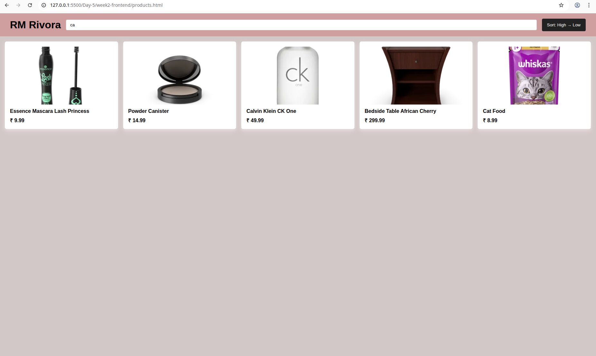
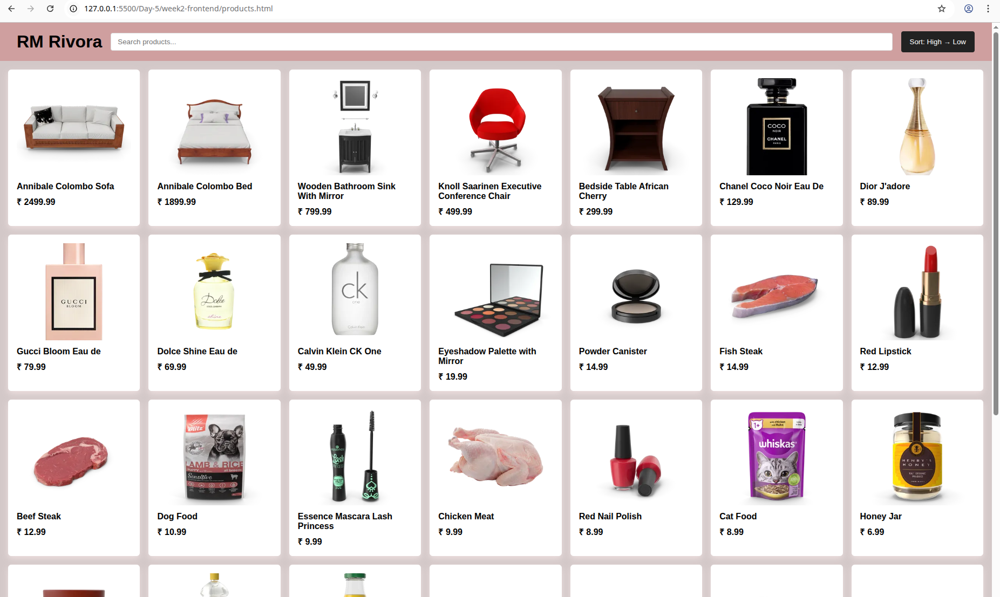
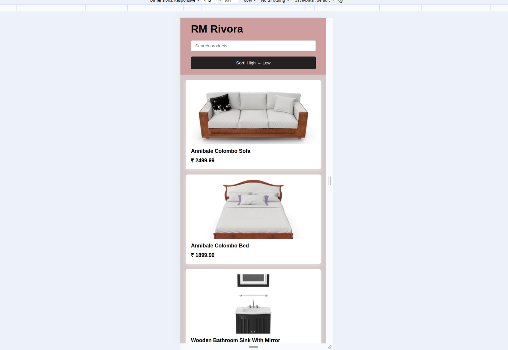

# Day - 5 Mini E-Commerce Product Listing 
## Project Overview

This project is a mini e-commerce product listing page built using HTML, CSS, and JavaScript.
It fetches real product data from an external API and displays it in a responsive UI with search and sort functionality.

This project is part of Day-5 (Capstone UI + JS Project) of my frontend learning journey.

---

## Features Implemented

- Fetch products using Fetch API

- Display products as dynamic cards

- Product image

- Product title

- Product price

- Search functionality

- Filter products by title in real time

- **Sort functionality:** Sort products by price (High → Low)

- **Responsive layout:** Works on desktop and mobile screens

---

## Tech Stack

**HTML5** – Page structure

**CSS3** – Layout, Grid, responsiveness

**JavaScript (ES6)** – Fetch API, DOM manipulation, events

## API Used

Dummy Products API

https://dummyjson.com/products

---

## What I Learned

- How to use Fetch API to get data from an external source

- How to render dynamic content using JavaScript
  
- Using array methods like:

- filter() for search

- sort() for sorting data
  
- DOM manipulation using:
  
- document.createElement
  
- innerHTML
  
- appendChild

- Building a responsive layout using CSS Grid

- Structuring a frontend project in a clean and scalable way

---

## Output

### Product Listing Page

### Search Functionality

### Sort by Price (High → Low)

### Mobile View

---
